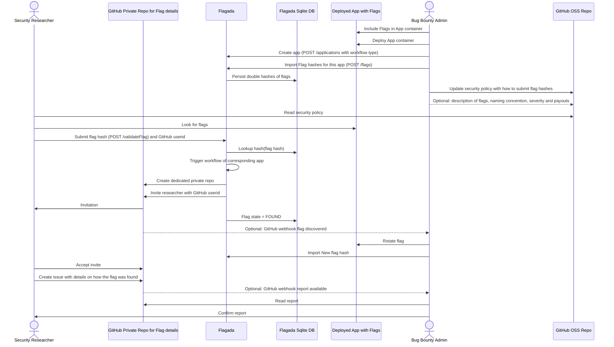

# Open Source proposed workflow 1

Goal: Avoid GitHub Security Advisories because
* it is only on/off: no way to filter a huge volume of reports without significant impact
* the create temporary fork feature does not scale well
* the permission model for managing those advisories is cumbersome

The proposed workaround
* Guarantees that the researcher can only see his own finding: a specific repo is created on the fly where he is invited
* Uses the battle tested Issue feature of GitHub (markdown available, no need to worry about malicious attachments)
* Uses the GitHub account of the researcher as identifier (rather than obscure email addresses)

Identified drawbacks
* Management overhead of 1 repo per finding (but this should be manageable if not too many flags are found in parallel)
* Not directly possible to work on the fix in this repo (cloning would be slow and consume storage). But anyhow a unique security mirror is the best practice for releasing security patches..

## Sequence diagram

NB: The detailed documentation of the Flagadi API can be found in the docs folder
