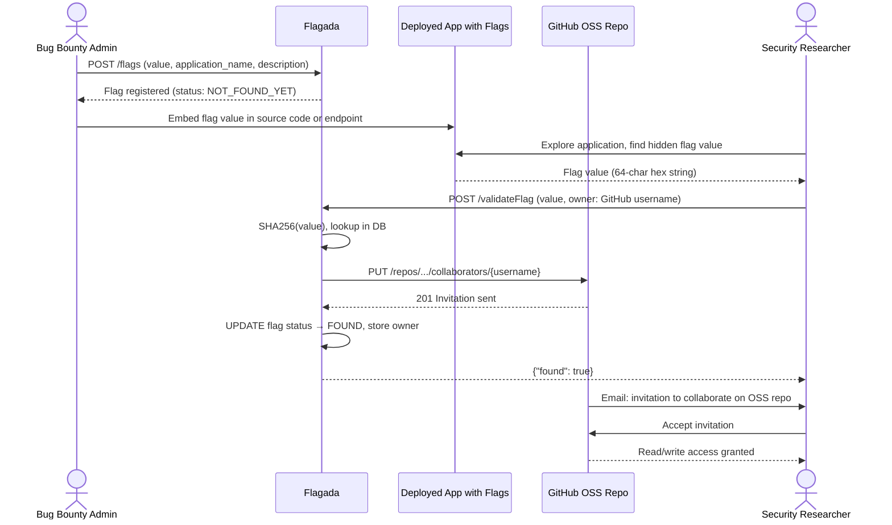

# Open Source proposed worfklow

```mermaid
sequenceDiagram
    actor Admin as Bug Bounty Admin
    participant Flagada
    participant App as Deployed App with Flags
    participant GitHub as GitHub OSS Repo
    actor Researcher as Security Researcher

    Admin->>Flagada: POST /flags (value, application_name, description)
    Flagada-->>Admin: Flag registered (status: NOT_FOUND_YET)

    Admin->>App: Embed flag value in source code or endpoint

    Researcher->>App: Explore application, find hidden flag value
    App-->>Researcher: Flag value (64-char hex string)

    Researcher->>Flagada: POST /validateFlag (value, owner: GitHub username)
    Flagada->>Flagada: SHA256(value), lookup in DB
    Flagada->>GitHub: PUT /repos/.../collaborators/{username}
    GitHub-->>Flagada: 201 Invitation sent
    Flagada->>Flagada: UPDATE flag status → FOUND, store owner
    Flagada-->>Researcher: {"found": true}

    GitHub->>Researcher: Email: invitation to collaborate on OSS repo
    Researcher->>GitHub: Accept invitation
    GitHub-->>Researcher: Read/write access granted
```
