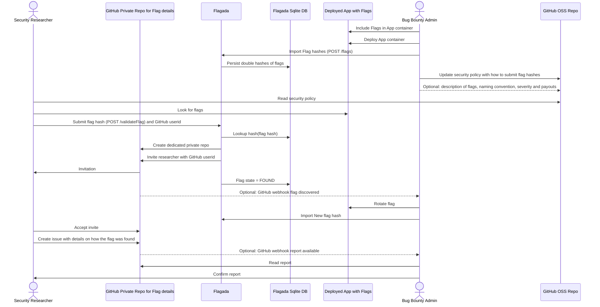

# Open Source proposed worfklow

```mermaid
sequenceDiagram
    actor Researcher as Security Researcher
    participant GitHub2 as GitHub Private Repo for Flag details
    participant Flagada
    participant DB as Flagada Sqlite DB
    participant App as Deployed App with Flags
    actor Admin as Bug Bounty Admin
    participant GitHub as GitHub OSS Repo

    Admin->>App: Include Flags in App container
    Admin->>App: Deploy App container
    Admin->>Flagada: Import Flag hashes (POST /flags)
    Flagada->>DB: Persist double hashes of flags
    Admin->>GitHub: Update security policy with how to submit flag hashes
    Admin-->>GitHub: Optional: description of flags, naming convention, severity and payouts
    
    Researcher->>GitHub: Read security policy
    Researcher->>App: Look for flags

    Researcher->>Flagada: Submit flag hash (POST /validateFlag) and GitHub userid
    Flagada->>DB: Lookup hash(flag hash)

    Flagada->>GitHub2: Create dedicated private repo
    Flagada->>GitHub2: Invite researcher with GitHub userid
    GitHub2->>Researcher: Invitation
    Flagada->>DB: Flag state = FOUND
    GitHub2-->>Admin: Optional: GitHub webhook flag discovered

    Admin->>App: Rotate flag
    Admin->>Flagada: Import New flag hash

    Researcher->>GitHub2: Accept invite

    Researcher->>GitHub2: Create issue with details on how the flag was found
    GitHub2-->>Admin: Optional: GitHub webhook report available

    Admin->>GitHub2: Read report
    Admin->>Researcher: Confirm report

```
